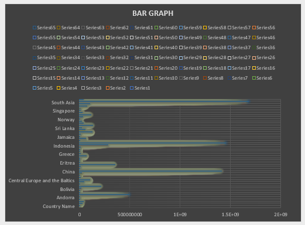
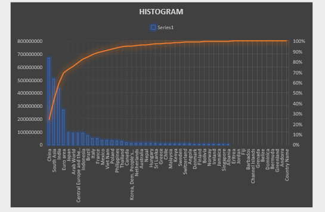
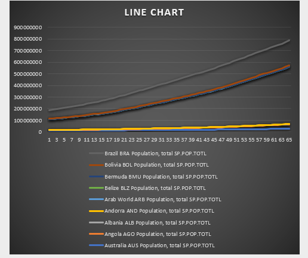

#SCT_DS_1
#Skill Craft Technology Internship — Data Science Task 1
*Task 1: Population Distribution Visualization*
This task involves analyzing and visualizing population data using Excel. The dataset is sourced from World Bank-style records, covering years from 1960 to 2024.
#Files Included
- `task1(SK).xlsx`: Contains two sheets:
- *Sheet 1*: Raw population data
- *Sheet 2*: Bar chart, histogram, and line chart visualizations
  #Visualizations
- *Bar Graph*: Shows categorical distribution  
  
- *Histogram*: Displays frequency distribution  
  
- *Line Chart*: Illustrates population growth over time  
  
These visualizations help interpret long-term demographic trends and support data-driven insights.

